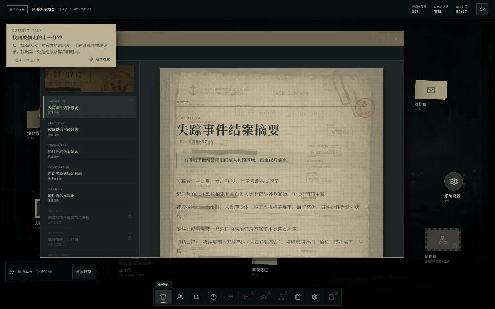
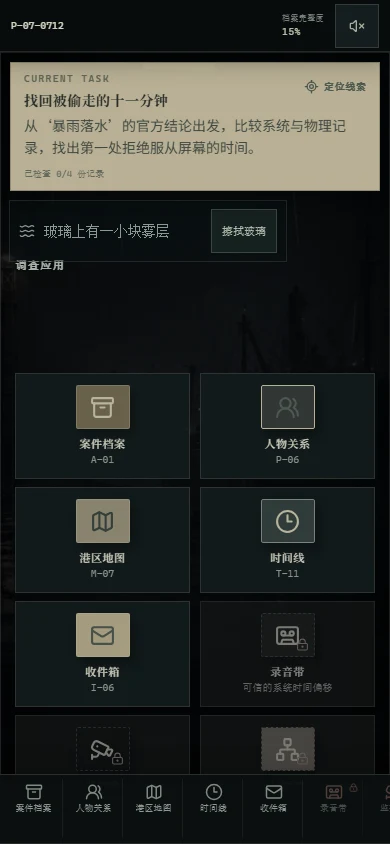
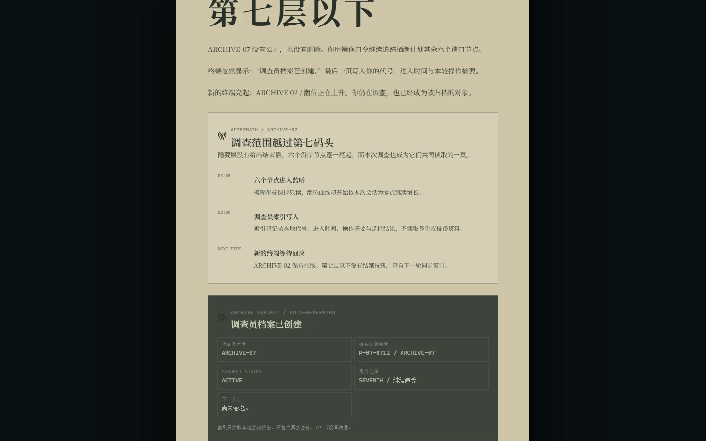

# 雾港档案：失踪的第七码头

一款可在浏览器中完整游玩的沉浸式悬疑解谜游戏。玩家将进入一间被封存的港口调查室，通过档案、录音、监控照片、证据关系与时间线重建失踪案真相，并根据调查深度抵达不同结局。

**[立即进入雾港调查室](https://fog-harbor-archive.luomo.moe)**


## 2.2 档案记得你

- 九个关键节点采用统一短演出：环境变化、短字幕、声音/视觉脉冲与可选档案定位均在 1.5–4 秒内完成，可立即跳过，并为 reduced motion 提供静态版本
- 归档印章与镜像地图改为环境式线索，不再显示触发计数或剧透入口；键盘、触控与辅助调查模式仍可完整发现
- 第二轮开始会出现更暗的调查室、远处轮廓、任务记忆与固定种子的低频环境异常；单轮最多两次，不改变证据、谜题或结局
- 调查笔记新增按轮次分组的系统记录与安全纯文本导出；导出不会读取身份、网络、浏览器或设备元数据
- Truth、Trade、Seventh 三个既有结局增加不同余波和可展开调查回顾，没有新增第四结局，也没有改变案件核心真相
- 正式截图、每周 Dependabot、分级 audit CI、WebP 社交封面与主背景预加载完成；公开目录不再包含 PNG

### 正式截图

桌面端调查室（1440×900）：



移动端调查流程（390×844）：



二周目调查员索引：



截图可使用固定本地档案状态重新生成，不依赖联网服务，也不会写入真实时间：

```bash
npm run capture:docs
```

## 2.1 调查体验

- 在原有五阶段框架中重排“官方结论 → 误导嫌疑 → 新证据纠正 → 责任分层 → 外部读取反转”，保留三个既有结局与案件核心真相
- 新增照片第二道人影的临时推理：第一次判断不会锁死主线，读取工具箱或声纹后可以修正，并在本地留下推理历史
- 许晚澄、顾惟安、陈牧与唐芷获得更完整的动机和责任层次；最终档案会区分事实、法律、道德责任与保护性谎言
- 新增不剧透的可选彩蛋、二周目铅笔批注与调查员索引，让重复调查获得额外叙事层次
- 默认采用无剧透说明：彩蛋完全可选，不参与主线谜题、档案完整度或结局门槛；本文档不会公开触发方式
- 普通逐区扫描只高亮可疑范围，辅助调查模式才会自动确认；责任链允许自由试放，并在提交后分项报告错误
- 新增桌面端与 `390×844` 触控端 Playwright 全流程回归，覆盖主线、二周目与彩蛋隔离性
- 新增 Node.js 22 + Chromium 的 GitHub Actions 持续集成与失败产物留档
- 生产公开目录只保留 WebP 运行时图片，原始 PNG 归档到 `design-assets/source/`，并排除出 Docker 构建上下文

## 2.0 调查体验

- 潮湿工业港口调查室：分层雨雾、玻璃水痕、远港灯光、真实纸张与设备材质
- 五阶段当前任务：直接定位目标窗口与标签，展示子进度、渐进提示和锁定原因
- 三套操作型核心谜题：双时间轴校准、录音信号锁定、3×2 照片复原与放大调查
- 可验证的证据墙：可信度判断、支持/矛盾关系与附带证据的五段责任链
- 动态案件时间：调查推进会将终端时间从 02:17 推至 03:07，并触发环境与通讯变化
- 完整移动端玩法：调查应用网格、带名称 Dock、全屏窗口、触控拼图、地图缩放和证据列表
- 兼容旧存档：继续使用 `fog-harbor-save-v1`，并为旧版已读关键证据提供迁移基础

## 游戏内容

- 11 个可操作调查模块，包含 23 条证据、11 份文档、9 段通讯与 3 份录音转写
- 4 个真实谜题：时间偏移、频率解码、碎片复原、证据链推演
- 7 名案件相关人物、11 个时间线节点、3 个正式结局与 1 条隐藏线索
- 本地存档、结局收藏、二周目文本、程序化环境音与完整静音控制
- 桌面和移动端布局、键盘操作、焦点管理、减少动态效果与高对比度适配

## 本地运行

需要 Node.js `>=22.13.0`。

```bash
npm install
npm run dev
```

开发服务器启动后，打开终端输出的本地地址即可进入游戏。

## 验证命令

```bash
npx playwright install chromium
npm run test:unit
npm run test:e2e
npm test
npm run test:all
npm run lint
npx tsc --noEmit
npm run build
npm run capture:docs
npm audit --omit=dev
npm audit
```

`npm run test:unit` 执行 Node.js 回归测试；`npm run test:e2e` 启动本地开发服务器并运行 Chromium 端到端测试。`npm test` 会先执行生产构建，再运行单元测试；`npm run test:all` 依次执行代码规范、类型检查、生产构建、单元测试和端到端测试。Playwright 的报告、失败截图、录像与追踪文件保存在 `output/playwright/`。

两条完整 audit 命令当前会按设计报告 2 个已记录的 moderate 公告并返回退出码 1；影响面、缓解措施与 CI 阈值见 [`docs/security/dependency-audit.md`](docs/security/dependency-audit.md)。

## 技术栈

- Next.js App Router、React、TypeScript
- Tailwind CSS、Framer Motion、Lucide React
- Zustand 持久化状态管理
- Vinext 构建，以及 Next.js standalone + Docker Compose 生产运行
- Cloudflare Tunnel 私有源站接入

存档保存在浏览器 `localStorage` 的 `fog-harbor-save-v1` 键中，会话彩蛋状态继续使用 `fog-harbor-easter-session-v1`。“重新开始”会保留已发现结局、调查日志和叙事记忆并进入下一轮；旧版存档会在本地完成字段清洗与迁移。

## 私有服务器部署

服务器版本使用 `Dockerfile.server` 和 `compose.server.yaml`。应用容器只映射到主机 `127.0.0.1:8797`，`cloudflared` 容器通过同一 Compose 网络访问应用，公网不需要开放应用端口。

当前生产入口为 `https://fog-harbor-archive.luomo.moe`。

部署机需要 Docker 与 Docker Compose，并在未提交的 `.env.server` 中提供远程管理 Tunnel 的 `TUNNEL_TOKEN`：

```bash
docker compose -f compose.server.yaml --env-file .env.server up -d --build
curl --fail http://127.0.0.1:8797/
```

## 主要目录

- `.github/workflows/`：Node.js 22、Chromium 与完整测试流水线
- `app/`：页面入口、全局样式与错误状态
- `components/`：启动流程、调查桌面、窗口、谜题和声音组件
- `components/cinematic/`：统一短演出字幕、视觉脉冲与事件呈现层
- `docs/screenshots/`：README 使用的固定尺寸 WebP 正式截图
- `docs/security/`：依赖公告、影响范围与缓解策略
- `design-assets/source/`：原始 PNG 设计源文件与校验清单，不进入 Docker 运行镜像
- `design-assets/marketing/`：社交封面设计源文件，不进入公开运行目录
- `e2e/`：桌面端、移动端、二周目与彩蛋隔离性端到端测试
- `lib/`：案件资料、证据、谜题、演出、环境事件、日志与结局规则
- `store/`：调查进度、存档校验与窗口状态
- `tests/`：生产构建、关键规则与资源边界回归测试
- `public/`：运行时 WebP、图标与社交分享封面
