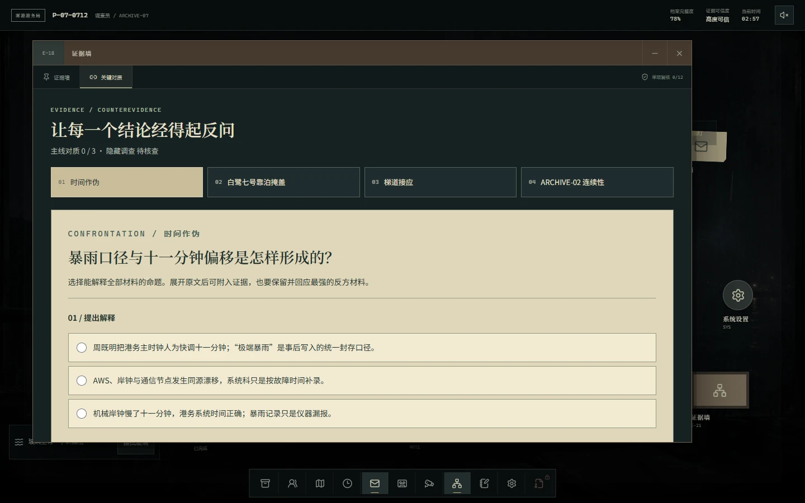
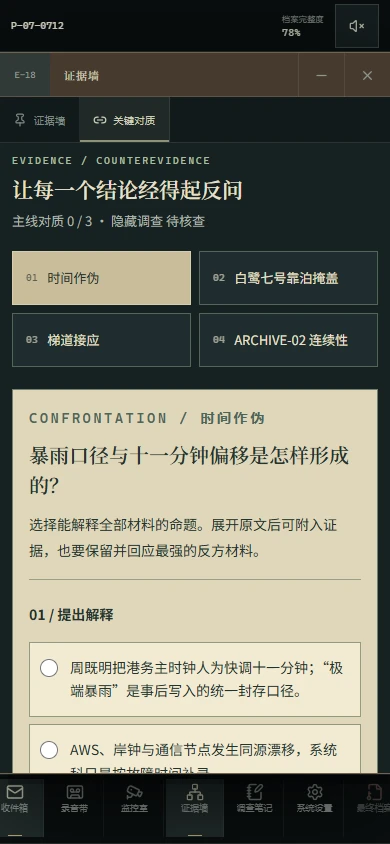

# 雾港档案：失踪的第七码头

一款可在浏览器中完整游玩的悬疑解谜游戏。进入封存的港口调查室，校准时间、修复录音、拼合照片，再用独立证据与反方材料重建失踪案。

[线上入口](https://fog-harbor-archive.luomo.moe) · [3.0 检查与升级记录](docs/releases/upgrade-t001.md) · [依赖审计](docs/security/dependency-audit-t001.md)


## 3.0 / 每个结论都需要证据

- **四项关键对质**：时间作伪、靠泊掩盖、梯道接应、外部节点。提交命题、阅读并附入证据、回应反方材料。三项主线成立后进入最终卷宗；隐藏路线需要另外证明系统延续性。
- **能追溯的剧情**：新增管理员审计、检修电台缓存、桶身残码与销毁器指纹。派生图像不算独立来源，照片无法证明的动作不再写成事实。
- **不同的公开范围**：全部公开、保护证人的有限公开、暂缓公开并继续跨港追踪。卷宗区分已确认事实、责任与未知；选择前说明消息源暴露和追责延迟的代价。
- **安全带走进度**：自动存档、对质草稿、JSON 备份与预览恢复。存储被禁用、空间不足或读取失败时仍可调查，并提示导出。损坏记录先保留副本。
- **旧档继续游玩**：读取 v1 并写入新的 v3 存档，原始 v1 保留。旧版已经完成的推理与隐藏关卡保留成果，不要求重玩。
- **一套生产运行链**：Next.js 16.3.4、React 19.2.8、Node.js 24；开发、构建、验证和 Docker 使用 Next。已移除 Vinext / Worker / Sites 临时托管层。

原有调查室、三个操作谜题、人物档案、时间线、笔记、程序化环境音、二周目与可选彩蛋继续保留。键盘、390×844 触控、辅助调查模式及减少动态效果均有回归覆盖。

## 界面

对质卷宗（桌面端）：



手机端对质与证据原文：



先启动本地生产服务器，再运行 `npm run capture:docs` 可生成下一组递增版本截图；旧截图不会被覆盖。

## 本地运行

需要 Node.js 24 和 npm >=11.6.1。

```sh
npm ci
npm run dev
```

生产构建与运行：

```sh
npm run build
npm run start -- --hostname 127.0.0.1 --port 3000
```

`start` 复制公开资源与静态文件到 standalone 目录，然后启动实际生产产物；不会隐式构建。也支持 `PORT`、`HOSTNAME` 环境变量。

## 验证

```sh
npx playwright install chromium
npm run test:all
```

完整检查包含代码规范、类型检查、Next 生产构建、生产 HTTP 与资源探测、单元测试和浏览器测试。Playwright 默认构建并启动生产服务器；指定 `PLAYWRIGHT_BASE_URL` 时测试该已有服务。Windows 可设置 `PLAYWRIGHT_BROWSER_CHANNEL=msedge` 使用已安装的 Edge。

```sh
npm run test:unit
npm run verify:production
npm run test:e2e
npm audit
```

测试日志与失败截图、录像、追踪文件保存在 `output/`，不提交到仓库。2026-09-06 的完整依赖审计为 **0 vulnerabilities**；这是一份日期明确的检查结果，后续公告由 CI 和 Dependabot 持续检查。

## 存档与恢复

当前调查保存到 `fog-harbor-save-v3`，会话彩蛋仍使用 `fog-harbor-easter-session-v1`。开场和系统设置均有“备份与恢复”入口。恢复前先展示代号、轮次与完成情况，确认后替换当前调查。

“重新开始本案”会清空本轮谜题、证据判断与对质，保留既有结局、轮次日志和叙事记忆。旧 `fog-harbor-save-v1` 不会被迁移过程覆盖。损坏内容的保留副本可从备份面板导出；它不是可直接导入的标准游戏备份。

备份包含调查员代号、笔记和剧情进度，仅由浏览器下载或读取，不上传到服务器。浏览器无法持久保存时，请导出后再关闭页面。

## 私有服务器部署

`Dockerfile.server` 构建 Next standalone 产物，以非 root 用户运行。`compose.server.yaml` 将应用绑定到主机 `127.0.0.1:8797`，Tunnel 通过 Compose 网络访问应用。

在未提交的 `.env.server` 中配置 `TUNNEL_TOKEN` 后：

```sh
docker compose -f compose.server.yaml --env-file .env.server up -d --build
curl --fail http://127.0.0.1:8797/
```

部署前保留当前镜像标签与 Compose 配置，发布后验证入口、静态资源和存档迁移；需要回滚时恢复旧镜像。旧版本仍能读取保留的 v1 原档，3.0 新进度应先导出。线上部署版本以实际发布为准。

## 目录

- `components/`：调查室、谜题、对质、卷宗和备份交互
- `lib/`：案件内容、对质规则、结局条件、存档适配与日志导出
- `store/`：持久化进度与窗口状态
- `tests/`、`e2e/`：规则与浏览器回归
- `scripts/`：生产启动、HTTP 验证与版本化截图
- `docs/`：正式截图、升级记录和历史审计
- `design-assets/source/`：只读源素材，不进入 Docker 镜像

历史版本说明见 [CHANGELOG](CHANGELOG.md)。
